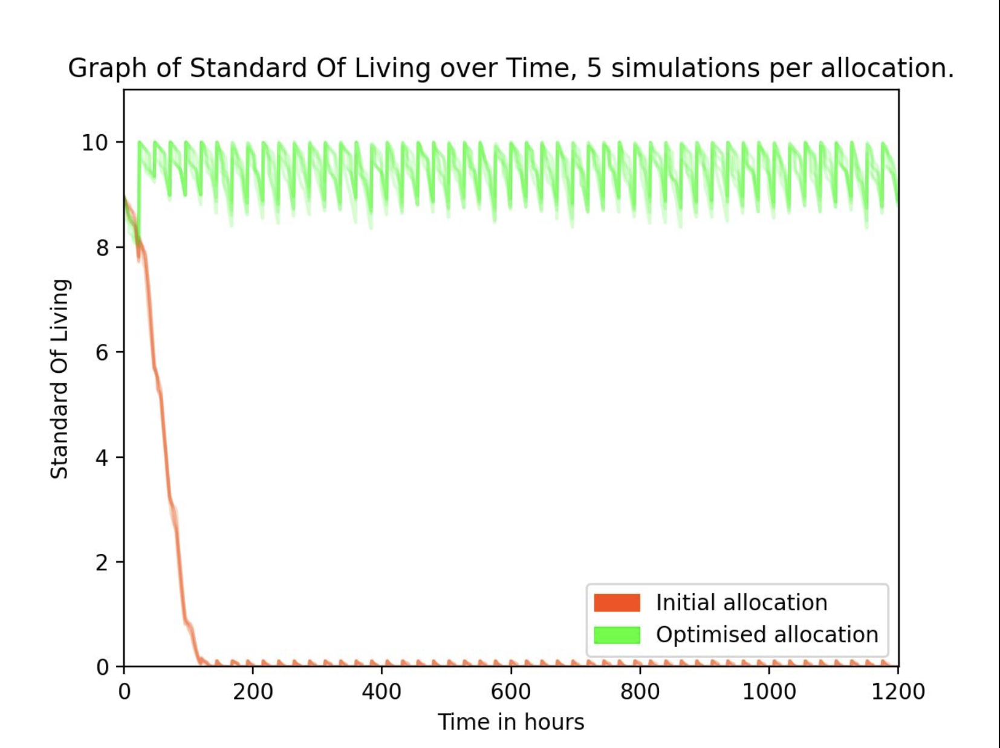

# Mars Water Simulation

## Summary

A submission for the [Xylem Global Student Innovation Challenge 2021](https://xyleminnovationchallenge.bemyapp.com/) challenge statement #4 - What if you lived on Mars?

>Your challenge is to support a water system for the first Mars City. Create a solution that will enable smarter and more successful production, reuse, monitoring or allocation of water.

In order to determine the optimal water budget for a Mars colony, we built a discrete-event simulator to run models of the colony's water system. 

## How it works

The simulation tracks the standard of living (SOL) of colonists based on how much water they are allowed to use for certain actions. Actions such as drinking, laundry, electrolysis can either occur regularly every day or at a random time every day, and directly impact the SOL of a colonist. If a colonist does not get the requested amount of water, their SOL will decrease.

Other entities such as wastewater tank recyclers and water generators act as sources of water, while certain actions such as electrolysis remove water from the system permanently. 

Based on the allocation of water for each action in the colony, the SOL of colonists can be monitored to see how successful the water management is. 



Special situations can be introduced as well - for example, by increasing the probability of using water for medical uses from 1% to 50%, we can introduce a kind of "pandemic situation".

## Running the simulation

1. Compile the jar file by running `gradle build`
2. Run the simulation with `java -jar build/libs/mars-water-simulation-1.0-SNAPSHOT.jar`, supplying the correct number of arguments as follows:
```bash
Usage: 
simulation.jar [drinking] [crop] [hygiene] [laundry] [flush] [medical] [electrolysis] [population] [noOfDays] [maximumDailyUsable]

Each argument, other than noOfDays and maximumDailyUsable refers to the ratio of water to allocate to that action.

noOfDays - Number of days to run the simulation for.

maximumDailyUsable - Maximum amount of water that can be used every day.
```
3. The simulation should output the standard of living for each hour as it runs.

Done by: Lam Jiajun, Shaun Ng Yue Hao, Poon Jia Qi
